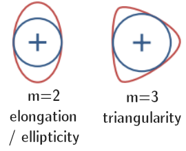

# open_density_limit_database

This repository contains the initial release of the *Open Density Limit Database*, a curated dataset of magnetic fusion experiments related to the density limit phenomenon.

## Contents
- `data/DL_DataFrame.*` – density limit dataset, available as csv and hdf5
- `demo.ipynb` – Jupyter notebook showing example usage:
  - Load and inspect the dataset
  - Train a linear SVM classifier (scikit-learn) to distinguish stable vs. unstable points
  - Plot decision boundary and ROC curve
  - Plot time traces from a single shot
- `figures/` – supporting figures used in this README and demo

## Motivation for the database

Fusion energy could one day transform the energy economy, but research progress up to this point has been hindered by closed, obscure, and/or poorly documented datasets. This presents large barriers for students and other newcomers to the field, at a time when there is a growing need for fusion education and workforce development [1-5]. 

This dataset is among first experimental magnetic fusion datasets explicitly released to the public for pedagogical purposes. We envision this dataset to be used in classrooms and tutorials to introduce students to fusion data science and machine learning with plasma physics data. For this reason, the dataset includes:
- Useful physics signals (`density`, `plasma_current`, etc.)
- Some less-useful variables to make analysis non-trivial
- A binary label (`density_limit_phase`) for supervised learning

In the future, we plan to release a larger, more comprehensive dataset for research purposes.

## Background on fusion energy and the density limit

[Fusion](https://ccfe.ukaea.uk/fusion-energy/fusion-in-brief/) is the process that powers the sun and stars, and it has the potential to provide a nearly limitless source of clean energy on Earth. However, achieving controlled fusion in a laboratory setting is challenging due to the complex behavior of [plasma](https://www.pppl.gov/about/about-plasmas-and-fusion) - the hot, ionized gas in which fusion reactions occur.

One obstacle for the leading type of magnetic fusion experiment is the "density limit" [[6]](https://doi.org/10.1088/0741-3335/44/8/201) - a phenomenon where the plasma collapses when its density gets too high. This limit is a significant obstacle to achieving sustained fusion reactions, as higher plasma densities can lead to much higher fusion power output.

This dataset contains measurements from the [Alcator C-Mod tokamak](https://en.wikipedia.org/wiki/Alcator_C-Mod) at the [MIT Plasma Science and Fusion Center](https://www.psfc.mit.edu/), including experiments with and without exhibiting the density limit phenomenon. 

A ["tokamak"](https://www.energy.gov/science/doe-explainstokamaks) is a doughnut-shaped magnetic chamber which uses strong magnets to hold the plasma in place as it reaches temperatures hotter than the core of the sun. Today, tokamaks are the leading design for magnetic fusion experiments worldwide.

This dataset was spun out of the PhD thesis of Andrew Maris, a graduate student at MIT applying machine learning to better understand the density limit [[7]](https://doi.org/10.1088/1741-4326/ad90f0). This dataset includes important variables (AKA features) describing the plasma's state, such as the density, plasma current, and magnetic field strength, along with labels indicating whether the plasma was stable or in the precursor phase of the density limit during each experiment.

## Dataset description

This dataset contains measurements from Alcator C-Mod interpolated onto a 10 ms timebase. Each row corresponds to a single time point in a discharge, with plasma parameters and density limit phase label. This dataset is a subset of the experimental catalogue and does not represent the full C-Mod database. Future releases will include more discharges.

### Features

The dataset includes the following columns:

- `discharge_ID`: Unique identifier for each discharge.
- `time`: Time point within the discharge. Early time points when the experiment is ramping up are excluded.
- `density_limit_phase` **(target variable)**: Label indicating whether the time point is before (0) or during (1) the precursor density limit instability. Although the "density limit" is a complex phenomenon, we simplify the problem to binary labels: "before" (0) or "during" (1) the precursor phase of the density limit.
- `density`: The average density of electrons in the plasma. Units: $10^{20}$ $\rm{m}^{-3}$
- `elongation`: How vertically elongated the plasma is. A value of 1 indicates a circular plasma, greater than 1 indicates the plasma is more tall than it is wide.
- `minor_radius`: Minor radius of the plasma (the smaller radius in a toroidal geometry). Units: meters
- `plasma_current`: Current flowing through the plasma. Units: Mega-Amperes (MA)
- `toroidal_B_field`: Magnetic field strength in the toroidal direction. Units: Tesla (T)
- `triangularity`: Shape parameter indicating how triangular the plasma cross-section is.

For visual reference, the effect of plasma elongation and triangularity on the plasma cross-section are shown below:

## License
- Data: CC BY license
- Code: MIT license

## Citation
If you use this dataset, please cite:

> Maris, A. D., Rea, C., Trevisan, G. L., & the Alcator C-Mod Team. *The Open Density Limit Database.* MIT Plasma Science and Fusion Center (2025).

## Credits
- Data assembly, demo development, and project execution: [Andrew D. Maris](https://andrewmaris.com/)
- Conceptual definition of project: Cristina Rea
- Data gather tools: Gregorio L. Trevisan and the [Disruption-py team](https://github.com/MIT-PSFC/disruption-py)
- Funding: the [Open and FAIR Fusion for Machine Learning Applications](https://disruptions.mit.edu/projects/open-fair-fusion/) grant, DOE Award DE-SC0024368
- Experimental measurements: the Alcator C-Mod team and the MIT Plasma Science & Fusion Center

## References

[1] T. Carter, et al., “Powering the Future: Fusion & Plasmas,” U.S. Department of Energy, Office of Science, Washington, DC, 2020. [OSTI 1995209](https://www.osti.gov/biblio/1995209).

[2] C. Paz-Soldan, et al., “Accelerating the Fusion Workforce,” *arXiv*, 2025. [arXiv:2501.03372](https://arxiv.org/abs/2501.03372).

[3] Fusion Energy Sciences Advisory Committee (FESAC), “Assessment of the Workforce Development Needs for the Fusion Energy Sciences,” FESAC Subcommittee on Workforce Development Needs, 2014. [Link](https://drive.google.com/file/d/1bHF1xTppHN14V-XsrHqmzjeyLM2mL6W1/view?pli=1).

[4] Committee on a Decadal Assessment of Plasma Science, Board on Physics and Astronomy, Division on Engineering and Physical Sciences, and National Academies of Sciences, Engineering, and Medicine, “Plasma Science: Enabling Technology, Sustainability, Security, and Exploration,” National Academies Press, Washington, DC, 2021. [Link](https://www.nap.edu/catalog/25802).

[5] D. G. Whyte, C. Paz-Soldan, and B. Wirth, “The academic research ecosystem required to support the development of fusion energy,” *Physics of Plasmas*, 2023. [doi:10.1063/5.0164101](https://doi.org/10.1063/5.0164101).

[6] M. Greenwald, et al., “Density limits in toroidal plasmas,” *Plasma Physics and Controlled Fusion*, 2002. [doi:10.1088/0741-3335/44/8/201](https://doi.org/10.1088/0741-3335/44/8/201).

[7] A. D. Maris, et al., “Correlation of the L-mode density limit with edge collisionality,” *Nuclear Fusion*, 2024. [doi:10.1088/1741-4326/ad90f0](https://doi.org/10.1088/1741-4326/ad90f0).
